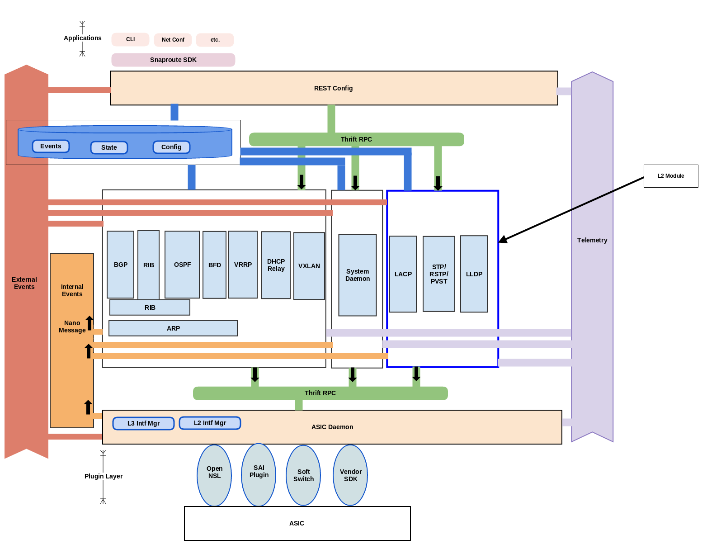

# l2
This code base is to handle all layer 2 protocols implementation.  Layer 2 Protocol are those which reside in the Data Link Layer within the OSI Model.

For a list of common protocols for each layer refer to the link below:
[OSI MODEL](https://en.wikipedia.org/wiki/List_of_network_protocols_(OSI_model)

Complete product documentation is available at 
[Product Overview] (http://opensnaproute.github.io/docs/)

Complete system architecture can be found 
[Here](http://opensnaproute.github.io/docs/architecture.html) 

# Architecture

# Modules
Each L2 Protocol will run as an independent daemon.  

1. [802.1AX (Version 1) LACP](lacp/README.md)
2. [802.1D-2004  Spanning Tree](stp/README.md)
3. [802.1AB LLDP](lldp/README.md)
