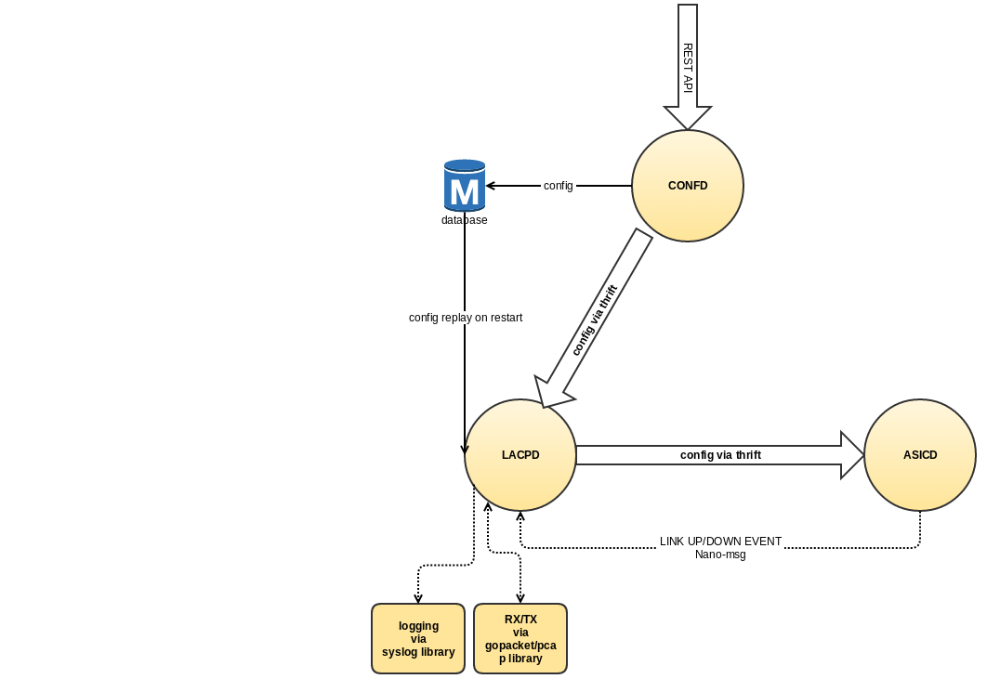

# Link Aggregation Control Protocol (LACP)
This code base is to handle the LACP protocol according to 802.1ax-2014.  This implemention currently only supports functionality related to version 1 of the protocol.

The protocol is a sandalone Process Daemon, with current dependencies with a configuration daemon CONFD and programability of HW ASIC and/or Linux Kernel via ASICD.

The LACP protocol will have an instance running per interface.   Each LACP represented state machine represented as part of the protocol will be running as a seperate go routine.


## Overview



## Interfaces
The protocol is a sandalone Process Daemon, with current dependencies with a configuration daemon CONFD and programability of HW ASIC and/or Linux Kernel via ASICD.

###### IPC
LACPD will receive configuration data from CONFD via Thrift IPC.
LACPD will send configuration data to ASICD via Thrift IPC.


###### Events
LACPD will receive Link UP/DOWN events from ASICD via Nano-msg

###### Packet RX/TX
LACPD will use [GOPACKET](https://github.com/SnapRoute/gopacket) pcap library to receive packets from a network interface.  Similarly GOPACKET will be used to encapsulate/decapsulate LACP/LAMP frames.


## Objects
Configuration and State objects are generated from the following [yang model](https://github.com/SnapRoute/models/tree/master/yangmodel/lacp) 

Using SnapRoute's yang to go [object generator](https://github.com/SnapRoute/reltools/tree/master/codegentools/structs) the following objects are generated for use by the LACPD.

```go

type LaPortChannel struct {
	BaseObj
	LagId          int32   `SNAPROUTE: "KEY",  DESCRIPTION: Id of the lag group`
	LagType        int32   `DESCRIPTION: Sets the type of LAG, i.e., how it is configured / maintained, SELECTION: LACP(0)/STATIC(1)`
	MinLinks       uint16  `DESCRIPTION: Specifies the mininum number of member interfaces that must be active for the aggregate interface to be available`
	Interval       int32   `DESCRIPTION: Set the period between LACP messages -- uses the lacp-period-type enumeration., SELECTION: SLOW(1)/FAST(0), DEFAULT: "1"`
	LacpMode       int32   `DESCRIPTION: ACTIVE is to initiate the transmission of LACP packets. PASSIVE is to wait for peer to initiate the transmission of LACP packets., SELECTION: ACTIVE(0)/PASSIVE(1), DEFAULT: "0"`
	SystemIdMac    string  `DESCRIPTION: The MAC address portion of the node's System ID. This is combined with the system priority to construct the 8-octet system-id, SELECTION: {'pattern': u'[0-9a-fA-F]{2}(:[0-9a-fA-F]{2}){5}'}`
	SystemPriority uint16  `DESCRIPTION: Sytem priority used by the node on this LAG interface. Lower value is higher priority for determining which node is the controlling system.`
	LagHash        int32   `DESCRIPTION: The tx hashing algorithm used by the lag group, SELECTION: LAYER2(0)/LAYER3_4(2)/LAYER2_3(1), DEFAULT: "0"`
	AdminState     string  `DESCRIPTION: Convenient way to disable/enable a lag group.  The behaviour should be such that all traffic should stop.  LACP frames should continue to be processed`
	Members        []int32 `DESCRIPTION: List of current member interfaces for the aggregate, expressed as references to existing interfaces`
}

type LaPortChannelState struct {
	BaseObj
	LagId             int32   `SNAPROUTE: "KEY",  DESCRIPTION: Id of the lag group`
	IfIndex           int32   `DESCRIPTION: the ifindex of the bonded interface`
	Name              string  `DESCRIPTION: The name associated with the aggregation object in linux`
	LagType           int32   `DESCRIPTION: Sets the type of LAG, i.e., how it is configured / maintained, SELECTION: LACP(0)/STATIC(1)`
	MinLinks          uint16  `DESCRIPTION: Specifies the mininum number of member interfaces that must be active for the aggregate interface to be available`
	Interval          int32   `DESCRIPTION: Set the period between LACP messages -- uses the lacp-period-type enumeration., SELECTION: SLOW(1)/FAST(0), DEFAULT: "1"`
	LacpMode          int32   `DESCRIPTION: ACTIVE is to initiate the transmission of LACP packets. PASSIVE is to wait for peer to initiate the transmission of LACP packets., SELECTION: ACTIVE(0)/PASSIVE(1), DEFAULT: "0"`
	SystemIdMac       string  `DESCRIPTION: The MAC address portion of the node's System ID. This is combined with the system priority to construct the 8-octet system-id, SELECTION: {'pattern': u'[0-9a-fA-F]{2}(:[0-9a-fA-F]{2}){5}'}`
	SystemPriority    uint16  `DESCRIPTION: Sytem priority used by the node on this LAG interface. Lower value is higher priority for determining which node is the controlling system.`
	LagHash           int32   `DESCRIPTION: The tx hashing algorithm used by the lag group, SELECTION: LAYER2(0)/LAYER3_4(2)/LAYER2_3(1), DEFAULT: "0"`
	AdminState        string  `DESCRIPTION: Convenient way to disable/enable a lag group.  The behaviour should be such that all traffic should stop.  LACP frames should continue to be processed`
	OperState         string  `DESCRIPTION: Operational status of the lag group.  If all ports are DOWN this will display DOWN.  If the group was admin disabled then will display DOWN.  No ports configured in group will display DOWN`
	Members           []int32 `DESCRIPTION: List of current member interfaces for the aggregate, expressed as references to existing interfaces`
	MembersUpInBundle []int32 `DESCRIPTION: List of current member interfaces for the aggregate, expressed as references to existing interfaces`
}

type LaPortChannelMemberState struct {
	BaseObj
	IfIndex                    int32  `SNAPROUTE: "KEY",  DESCRIPTION: Reference to aggregate member interface`
	LagId                      int32  `DESCRIPTION: Id of the lag group to which this port is associated with`
	OperState                  string `DESCRIPTION: The operation state, typically UP IN BUNDLE, or DOWN`
	LagIfIndex                 int32  `DESCRIPTION: Interface member of the LACP aggregate`
	Activity                   int32  `DESCRIPTION: Indicates participant is active or passive, SELECTION: ACTIVE(0)/PASSIVE(1)`
	Timeout                    int32  `DESCRIPTION: The timeout type (short or long) used by the participant, SELECTION: SHORT(1)/LONG(0)`
	Synchronization            int32  `DESCRIPTION: Indicates whether the participant is in-sync or out-of-sync, SELECTION: OUT_SYNC(1)/IN_SYNC(0)`
	Aggregatable               bool   `DESCRIPTION: A true value indicates that the participant will allow the link to be used as part of the aggregate. A false value indicates the link should be used as an individual link`
	Collecting                 bool   `DESCRIPTION: If true, the participant is collecting incoming frames on the link, otherwise false`
	Distributing               bool   `DESCRIPTION: When true, the participant is distributing outgoing frames; when false, distribution is disabled`
	Defaulted                  bool   `DESCRIPTION: When no partner information is exchanged port will come up in a defaulted state`
	SystemId                   string `DESCRIPTION: MAC address that defines the local system ID for the aggregate interface, SELECTION: {'pattern': u'[0-9a-fA-F]{2}(:[0-9a-fA-F]{2}){5}'}`
	OperKey                    uint16 `DESCRIPTION: Current operational value of the key for the aggregate interface`
	PartnerId                  string `DESCRIPTION: MAC address representing the protocol partner's interface system ID, SELECTION: {'pattern': u'[0-9a-fA-F]{2}(:[0-9a-fA-F]{2}){5}'}`
	PartnerKey                 uint16 `DESCRIPTION: Operational value of the protocol partner's key`
	DebugId                    uint32 `DESCRIPTION: Debug Information Id`
	RxMachine                  int32  `DESCRIPTION: Current Rx Machine State, SELECTION: RX_CURRENT(0)/RX_PORT_DISABLE(5)/RX_DEFAULTED(2)/RX_LACP_DISABLED(4)/RX_EXPIRED(1)/RX_INITIALIZE(3)`
	RxTime                     uint32 `DESCRIPTION: Time at which the last LACPDU was received by a given port,  in terms of centiseconds since the system was last reset`
	MuxMachine                 int32  `DESCRIPTION: Current MUX Machine State, SELECTION: MUX_COLLECTING(3)/MUX_COLLECTING_DISTRIBUTING_DEFAULTED(7)/MUX_COLLECTING_DISTRIBUTING(5)/MUX_DISTRIBUTING_DEFAULTED(6)/MUX_ATTACHED(2)/MUX_DETACHED(0)/MUX_DISTRIBUTING(4)/MUX_WAITING(1)`
	MuxReason                  string `DESCRIPTION: Reason for the most recent MUX state change`
	ActorChurnMachine          int32  `DESCRIPTION: Actor Churn Detection Machine State, SELECTION: CHURN_NO_CHURN(0)/CHURN_CHURN(1)`
	PartnerChurnMachine        int32  `DESCRIPTION: Partner Churn Detection Machine State, SELECTION: CHURN_NO_CHURN(0)/CHURN_CHURN(1)`
	ActorChurnCount            uint64 `DESCRIPTION: Number of times the Actor State machine has entered the  ACTOR_CHURN state`
	PartnerChurnCount          uint64 `DESCRIPTION: Number of times the Partner State machine has entered the  ACTOR_CHURN state`
	ActorSyncTransitionCount   uint64 `DESCRIPTION: Number of times the Actor's Mux state machine has entered the  IN_SYNC state.`
	PartnerSyncTransitionCount uint64 `DESCRIPTION: Number of times the Partner's Mux state machine has entered the  IN_SYNC state.`
	ActorChangeCount           uint64 `DESCRIPTION: Number of times the Actor's perception of the LAG ID for the  Aggregation Port has changed.`
	PartnerChangeCount         uint64 `DESCRIPTION: Number of times the Partner's perception of the LAG ID for the  Aggregation Port has changed.`
	ActorCdsChurnMachine       int32  `DESCRIPTION: If supported Actor CDS Churn Machine State, SELECTION: CHURN_NO_CHURN(0)/CHURN_CHURN(1)`
	PartnerCdsChurnMachine     int32  `DESCRIPTION: If supported Partner CDS Churn Machine State, SELECTION: CHURN_NO_CHURN(0)/CHURN_CHURN(1)`
	ActorCdsChurnCount         uint64 `DESCRIPTION: If supported the number of times the Actor CDS Churn state has entered the ACTOR_CDS_CHURN state`
	PartnerCdsChurnCount       uint64 `DESCRIPTION: If supported the number of times the Actor CDS Churn state has entered the ACTOR_CDS_CHURN state`
	LacpInPkts                 uint64 `DESCRIPTION: Number of LACPDUs received`
	LacpOutPkts                uint64 `DESCRIPTION: Number of LACPDUs transmitted`
	LacpRxErrors               uint64 `DESCRIPTION: Number of LACPDU receive packet errors`
	LacpTxErrors               uint64 `DESCRIPTION: Number of LACPDU transmit packet errors`
	LacpUnknownErrors          uint64 `DESCRIPTION: Number of LACPDU unknown packet errors`
	LacpErrors                 uint64 `DESCRIPTION: Number of LACPDU illegal packet errors`
	LampInPdu                  uint64 `DESCRIPTION: Number of LAMPDU received`
	LampInResponsePdu          uint64 `DESCRIPTION: Number of LAMPDU Response received`
	LampOutPdu                 uint64 `DESCRIPTION: Number of LAMPDU transmited`
	LampOutResponsePdu         uint64 `DESCRIPTION: Number of LAMPDU Response received`
}
```
Lacp Module is not dependent on the generated model and only uses it as a means to the data to retreive.  The general data store within the lacp module mainly follows the standards object representations.


## Build
Building lacp module requires you to run the [setup](https://github.com/SnapRoute/reltools/blob/master/setupDev.py) in order to have the SnapRoute src as well as external repo dependencies.

**Build lacp only**

From top level make SnapRoute/src/:
```
   make codegen
   make ipc
```
From lacp SnapRoute/src/l2/lacp/:
```
   make
```
**Build lacp as part of all**

From top level make SnapRoute/src/:
```
  make
```

## Test
There are multiple test supported for LACP

###### Unit Test
Go test framework is used for unit testing.   The tests are meant to test the various state machines within LACP.  For these tests for some cases two lacp instances are running and packets are sent over go channels.

For running the test I like to use '-v' option to let me know what test are running.
```
   cd protocol
   go test -v
```

###### Integration Test
Integration tests can be found in the in the test repo under [lacp](https://github.com/SnapRoute/test/blob/master/tests/lacp/lacp.py)
Integration tests are written in python.   Within the file there is a python dictionary describing the setup.  The setup is assuming two switches and 2 ports each.  


The test is dependent on using the auto-generated [Sdk](https://github.com/SnapRoute/flexSdk/blob/master/py/flexswitchV2.py).

```
   // go to reltools (your path may differ)
   cd ~/git/reltools/
   make codegen
   // go to test repo (your path may differ)
   cd ~/git/snaproute/src/test/
   source env.sh
   cd tests/lacp/
   python lacp.py
```


## REST API
The rest api's example are taken from an auto generated python [SDK](https://github.com/SnapRoute/flexSdk/tree/master/py)
SDK is generated as part of 'make codegen' or 'make'

###### Example API using python
Api parameter description can be found in SDK
```
    createLaPortChannel
    deleteLaPortChannel
    updateLaPortChannel
```

